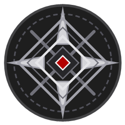

<div align="center">



# DED Launcher

**Современный лаунчер Minecraft для DED-комьюнити**

Лёгкий, быстрый и безопасный кастомный лаунчер Minecraft с друзьями, чатом,
скинами, модами и полной настройкой — всё в одном окне.

[Скачать последнюю версию](https://github.com/jeka992/DEDLauncher/releases/latest)
·
[Telegram-канал обновлений](https://t.me/NeiroDEDmod)
·
[MIT License](LICENSE)


</div>

---

## Возможности

### Запуск игры
- **Ваниль, Fabric, Forge, OptiFine** — установка загрузчиков в пару кликов
- **Любые версии Minecraft** — релизы, снапшоты, старые альфа/бета
- **Профили с изоляцией** — у каждого свои моды, миры и настройки
- **Автоподбор Java** — если Java не найдена, лаунчер сам скачает и установит
  нужную версию Temurin JDK
- **Оптимизация под слабые ПК** — режим Low-End, программный рендеринг
- **IPv4-only режим** — без зависаний на IPv6-резолве

### Друзья и чат
- **Друзья по коду** — добавь человека по 8-символьному коду
- **E2E-шифрование** — личные сообщения шифруются AES-256-GCM через ECDH,
  подписываются ECDSA P-256
- **Статус и присутствие** — кто на каком сервере играет
- **Приглашения на сервер** — зови друзей одним кликом
- **Групповые чаты** — с настоящей криптографией (случайный ключ группы)
- **Обмен скинами и плащами** — проси у друзей их скин прямо из чата

### Моды и контент
- **Modrinth и CurseForge** — поиск и установка модов, ресурспаков и шейдеров
- **Автоматическая установка зависимостей** — не нужно думать о «required»
- **Включение/отключение модов** — без удаления файлов
- **DED Mod** — фирменный мод лаунчера для скинов, плащей и присутствия

### Внешний вид
- **Тёмная тема** с 6 акцентными цветами (Красный, Синий, Зелёный, Фиолетовый,
  Оранжевый, Монохром)
- **Настройка размера шрифта**
- **Превью скина и плаща** прямо в лаунчере

### Дополнительно
- **Консоль запуска** — живой лог игры
- **Статистика игровых сессий**
- **Скриншоты** — просмотр прямо из лаунчера
- **Проверка обновлений** через Telegram-канал
- **Логирование** в `%appdata%/.dedlauncher/launcher.log`

---

## Установка

1. Скачай архив со [страницы релиза](https://github.com/jeka992/DEDLauncher/releases/latest)
2. Распакуй в отдельную папку
3. Запусти `DEDLauncher.exe`
4. Создай профиль, выбери версию Minecraft — и играй!

> Требуется **Windows 10/11** и **.NET 8 Desktop Runtime**.
> При первом запуске с Microsoft-аккаунтом может понадобиться **WebView2 Runtime**.

---

## Сборка из исходников

```bash
git clone https://github.com/jeka992/DEDLauncher.git
cd DEDLauncher
dotnet restore
dotnet publish -c Release -r win-x64 --self-contained false
```

Сборка выйдет в `bin/Release/net8.0-windows/publish/`.

### Зависимости (NuGet)

| Пакет | Версия |
|---|---|
| CmlLib.Core | 4.0.6 |
| CmlLib.Core.Auth.Microsoft | 3.1.0-beta.4 |
| MQTTnet | 5.0.0.1405 |

---

## Безопасность

- **Подпись обновлений** — ECDSA P-384, обновления без валидной подписи не применяются
- **E2E-шифрование чата** — ECDH P-256 + AES-256-GCM + ECDSA P-256 подписи
- **DPAPI-защита ключей** — приватные ключи и токены привязаны к пользователю и машине
- **Проверка SHA-256** скачанных модов из Modrinth
- **Лимиты скачивания** — таймаут 10 минут, максимум 512 МБ на файл

---

## Структура проекта

```
├── App.xaml(.cs)          # Точка входа, автообновление
├── MainWindow.xaml(.cs)   # Главное окно
├── Converters/            # WPF-конвертеры
├── Helpers/               # Криптография, пути, NBT, системная информация
├── Models/                # Модели данных
├── Services/              # Моды, Java, скины, друзья, обновления, темы
├── Themes/                # Тёмная тема
└── ViewModels/            # Логика UI (MVVM)
```

---

## Лицензия

Распространяется по лицензии [MIT](LICENSE).

<div align="center">
<sub>DED Launcher © 2026 — сделано для своих</sub>
</div>
